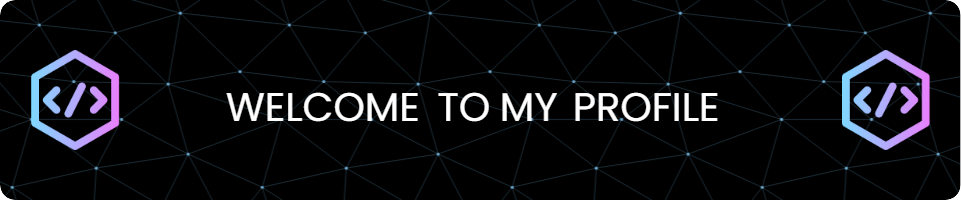

<!--Banner-->

<!--Night Owl image-->

  

<!--Header Name-->
#  ɪ'ᴍ ᴛᴜʜɪɴ!
*Android App Developer | Library Publisher | Open-Source Enthusiast*
  

<!--Start Intro-->               

I am a passionate Android App developer who loves building libraries and contributing to open-source projects. My expertise lies in developing mobile applications and publishing libraries that enhance Android development workflows. 

- ✨ Student of life :)
- 🌱 I’m currently learning many things, I believe that everyday is a learning opportunity.
- 💁‍♂️ Always learning and exploring **Advanced Android Development**.
- ✍ Ask me about **Android, Gradle, Open-Source**.
- ❤ Contributing to Open Source.
<!--End Intro-->

<!--Profile Count Badge-->

  

---

<!--Languages and Tools Section-->       
<h2 align="center">Tᴇᴄʜ sᴛᴀᴄᴋ</h2> 
<picture>
  <source media="(prefers-color-scheme: dark)" srcset="./assets/gif/Skills_Animation_Dark.gif">
  <source media="(prefers-color-scheme: light)" srcset="./assets/gif/Skills_Animation_White.gif">
  
</picture>
 

<h3 align="left">Current Learning</h3>
<ul align="left">
  <li>Enhancing my skills in Advanced Android Development.</li>
  <li>Learning about Kotlin Multiplatform to develop cross-platform applications.</li>
  <li>Exploring best practices in Gradle build system for Android libraries.</li>
  <li>Improving my knowledge of Jetpack Compose for modern Android UI development.</li>
  <li>Exploring performance optimization techniques for Android applications.</li>
  <li>Learning best practices for managing multi-module projects in Android.</li>
</ul>

<!--Code Type Gif-->

<h1>

</h1>

<!--Trophies Section-->   
<h2 align="center">🏆 Gɪᴛʜᴜʙ Tʀᴏᴘʜɪᴇs 🏆</h2>

  <a href="https://github.com/softdev-pro">
    <picture>
      <source media="(prefers-color-scheme: dark)" srcset="https://github-profile-trophy.vercel.app/?username=softdev-pro&no-bg=true&row=2&column=6&margin-w=20&margin-h=20&theme=monokai">
      <source media="(prefers-color-scheme: light)" srcset="https://github-profile-trophy.vercel.app/?username=softdev-pro&no-bg=true&row=2&column=6&margin-w=20&margin-h=20">
      
    </picture>
  </a>

 

<!--Github stats Table--> 
<h2 align="center">📊 Gɪᴛʜᴜʙ Sᴛᴀᴛs 📊</h2>

<table width="100%">
  <tr>
    <td width="50%">
      <h3 align="center"><strong>Gɪᴛʜᴜʙ Sᴛᴀᴛs</strong></h3>
      

        
      

    </td>
    <td width="50%">
      <h3 align="center"><strong>Sᴛʀᴇᴀᴋ Sᴛᴀᴛs</strong></h3>
      

        
      

    </td>
  </tr>
  <tr>
    <td width="50%">
      <h3 align="center"><strong>Mᴏꜱᴛ Uꜱᴇᴅ Lᴀɴɢᴜᴀɢᴇꜱ</strong></h3>
      

        
      

    </td>
    <td width="50%">
      <h3 align="center"><strong>Tᴏᴘ Cᴏɴᴛʀɪʙᴜᴛɪᴏɴs</strong></h3>
      

        
      

    </td>
  </tr>
</table>
 

<!--Contribution Graph-->
<h2 align="center">📈 Cᴏɴᴛʀɪʙᴜᴛɪᴏɴ Gʀᴀᴘʜ 📈</h2>

    

---

<!--Dynamic Quote card updates everyday at 12 PM--> 
<h2 align="center">🌟 Tʜᴏᴜɢʜᴛ ᴏғ ᴛʜᴇ Dᴀʏ 🌟</h2>

<!--STARTS_HERE_QUOTE_CARD-->

    

<!--ENDS_HERE_QUOTE_CARD-->

<!--Code Type Gif-->

<h1>

</h1>

<!--Contact Section--> 
<h2 align="center">🤝 Cᴏɴɴᴇᴄᴛ Wɪᴛʜ Mᴇ 🤝 </h2>

  
  
  

<!--Footer--> 

  

